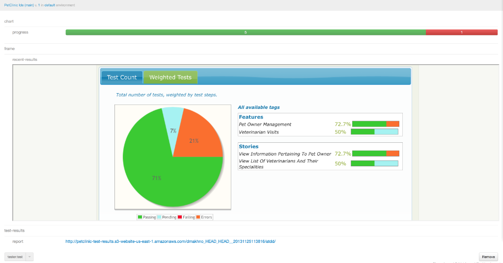
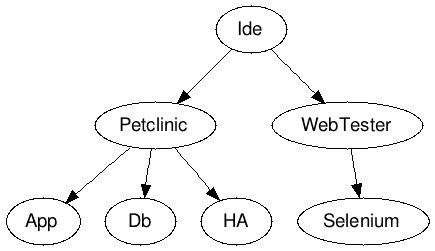
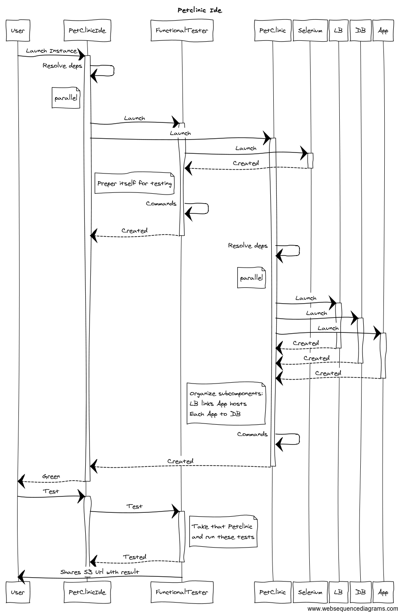

 Functional Tester
=============

Base Qubell component for functional testing with java, mvn, git, s3, thucydides.

Reasoning
---------

Usually testing process in sw-development differs a lot in details, but in common it looks the same. It would be nice to bring building bricks and allow to mix and extend that bricks.

80% of cases will be covered by:

1. Find a host machine
2. Get test sources from Source Control
3. Compile and execute tests, ensure that you have deployed your app
4. Analyse results and prepare reports
5. Upload results

So what drove us:
- easy reuse
- simple extension
- use real examples

Implementation
--------------

We took a step back to process above, and looked at it as, what is really general and how to prove that it might work.
What we have

### Eagle sight

Simple concept:

1. Prepare and deploy software under test
2. Prepare test environment
3. Test-Analyse-Report via test environment to software under test

### Prove

Let's took [PetClinic](http://qubell.com/solutions/pet-clinic/) as a representative of a web applications.

Test flow will be implemented as

|   | Flow                                 | Implementation                  |
|:--|:-------------------------------------|:--------------------------------|
| 1 | Find a host machine                  | Provision host and install Java |
| 2 | Get test sources from Source Control | Get sources from Git            |
| 3 | Compile and execute tests            | Use Maven `*`                   |
| 4 | Analyse results and prepare reports  | Thucidides and JUnit Reports    |
| 5 | Upload results                       | Upload to s3 with web-hosting   |

`*` - Maven actually compiles integration tests, that are based on [Thucidides](http://www.thucydides.info/) framework, this allows get nice report and BDD-styled tests. Thucidides is configured to use Remobe Browser, and [Selenium-Grid Component](https://github.com/qubell/component-selenium-grid) cares of this.

Note:

Quick Start
-----------

Compoent is configured for quick launch with AWS EC2 and in default is a companion for [PetClinic Compoennt](https://github.com/jollyrojer/component-petclinic-main) and [Selenium-Grid Component](https://github.com/qubell/component-selenium-grid).

> Before you start working with it within the Qubell platform, you need to obtain an AWS account, capable of creating EC2 nodes. The EC2 security group ‘default’ has to allow connections on the following ports:
> - 22 (SSH)
> - 4444 (Selenium Hub)
> - 80 (HTTP)
> - 3306 (MySQL)
> - 22002 (HTTP, will be used for HAProxy management console)

This component requires:
- 5 vms, 3 - Petclinic (lb, app, db), 1 Selenium Grid, 1 Tester's host.
- configured S3 ensure to configure it properly.

### S3 Preparation

All results from test are stored in single place. Configure S3 as following:
- Create Bucket
- Set Permission bucket policy, don't forget to replace `BUCKET-NAME` with yours:

``` json
{
	"Version": "2008-10-17",
	"Statement": [
		{
			"Sid": "AllowPublicRead",
			"Effect": "Allow",
			"Principal": {
				"AWS": "*"
			},
			"Action": "s3:GetObject",
			"Resource": "arn:aws:s3:::BUCKET-NAME/*"
		}
	]
}
```
this should set read properties for any new item in the bucket.

- Enable bucket Static Web Hosting

Now you should know following
``` yml
    s3.bucket:       #  BUCKET-NAME
    s3.static-web:   #  http://BUCKET-NAME.s3-website-us-east-1.amazonaws.com
    s3.https-direct: #  https://s3.amazonaws.com/BUCKET-NAME
```
You'll need them to properly configure report storage. Please note, they may differ, check in Bucket properties.

### Launch

1. Grab component by "Get it now" from [here](http://rawgithub.com/qubell/component-functional-tester/master/_resources/ide.html) to you prefered organization.
  * Use manifest editor (`[Wheel]` -> `Manifest`)  to set configuration for "Functional Tester", for sure you have to set: `s3.bucket`, `s3.static-web`, `s3.https-direct`.
2. Configure if `Platform`->`Cloud Account` hasn't configured AWS
3. Configure if `Environment`->`default` hasn't associated Cloud Account
4. In `default` environment create `s3-crediantials` property
  * `map<string,string>` as type  
  * value is

``` yml
access-key: <YOUR aws-id-key>
secret-key: <YOUR aws-secret-key>
```

5. Go to `Applications` and press `[Launch]` on `PetClinic Ide`
6. Wait
7. On Done, you should have Running Petclinic and Ready Tester
8. Run `tester.test` command with string parameter, e.g. "hello"
9. Wait
10. On Done, you should see results



> View may differ, according to your configuration

Tune and Manage
----------------

### Functional Tester

The component itsef is slplit into following sub-modules:
- java-vm - virtual machine with installed java, it plays a role of a host for anything that is made by tester
- maven - prepares maven on host and provides `build` command to execute manen's goals
- git - prepares git on host and provides `clone` command to clone git source
- s3 - prepares s3cmd on host and provides `upload` command to upload destination to bucket
- reporter - do some tricks with junit results to organize them, to look pretty on qubell ui, this is the less reusable component
- tester - orcestrate with other components to do actual testing, it provides simple command `test`
- selenium - sub-module, that allows to use selenium-grid

### Root (getting all together)

It was mentioned that Functional Tester designed to validate ability to test PetClinic. 
Here is diagram that shows modules structer



### Usage scenarious

You may see the power starting to use Shared Catalog.
Share:
- Selenium, to have single organization Selenium-Grid
- Functional Tester, to speed up testing of different petclinics
- Petclinic, to debug tests without redeployment of porduct

### Flow explanation



### Supported Operation Systems

It was tested on Ubuntu 12.04 LTS, others should work too.

FAQ
---

Q: What is Thucidides  
A: Find more on offical site [Thucidides](http://www.thucydides.info/), and nice presentation [Introduction ot Thucydides](http://www.slideshare.net/wakaleo/introduction-tothucydides-9724999)
